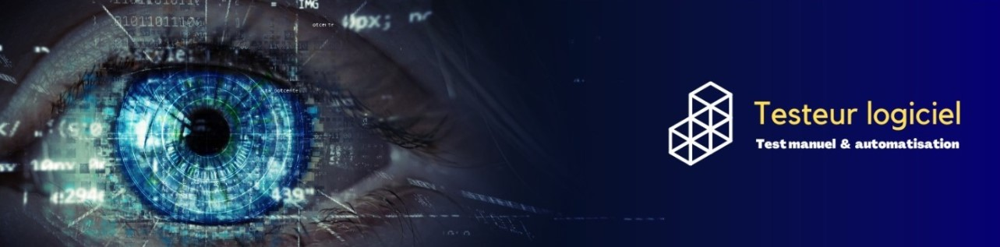

<h1 align="center"> Bonjour je m'appelle Rémy. </h1>

<h2 align="center"> Je suis testeur logiciel - Certifié ISTQB Fondation. </h2>

* 💼 Je travaille actuellement chez Sogeti en tant que testeur logiciel junior
  * 👉 Cérémonies Agile (dailymeeting, sprint, démo, rétrospective)  
  * 👉 Cahier des charges et spécifications fonctionnelles  
  * 👉 Conception, analyse, exécution, évolution du patrimoine de test
  * 👉 Automatisation
* 👩‍🎓 J'ai obtenu la certification ISTQB Fondation le 23/12/2022
* 📫 Vous pouvez me contacter à l'adresse suivante : becart.remy@gmail.com

## Outils

## Github

## Vous pouvez me retrouver sur les réseaux sociaux
 
